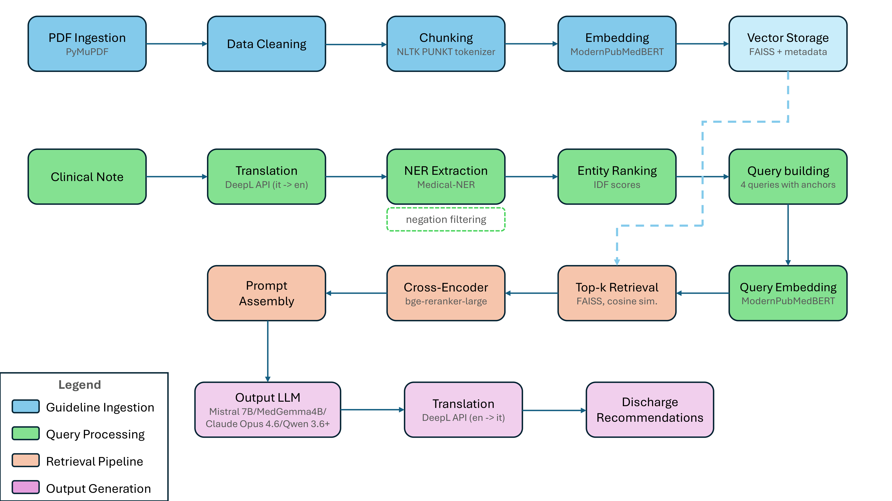

# ER Discharge Recommendations via RAG

A Retrieval-Augmented Generation pipeline that ingests ER clinical documents (in Italian) and generates guideline-grounded discharge recommendations based on official European guidelines.

The system extracts relevant clinical entities from ER notes, retrieves matching guideline passages through a multi-stage retrieval pipeline, and produces structured discharge recommendations via an LLM. Translation between Italian and English is handled automatically via DeepL.

For a detailed discussion of the architecture, evaluation, and design rationale, the project paper is included in the repo.



## Repository Structure

```
.
├── code/
│   ├── main.py              # Main pipeline entry point
│   ├── build_index.py        # Guideline ingestion and FAISS index builder
│   └── config.py             # All configurable parameters (models, paths, API keys)
├── Examples/                  # Sample clinical notes, translations, and generated outputs
├── Weights/                   # Pre-trained model weights and FAISS index (ready to use)
├── Guidelines/                # Optional - Must be created and populated manually (see below)
├── requirements.txt
└── README.md
```

## Setup

### 1. Install dependencies

```bash
pip install -r requirements.txt
```

#### llama-cpp-python (optional — only for quantized local models)

If you want to run quantized models locally via llama.cpp, the library requires a separate installation. The recommended approach is to use a **pre-built wheel** matching your CUDA version (supported for CUDA 12.1–12.5):

```bash
pip install llama-cpp-python \
  --extra-index-url https://abetlen.github.io/llama-cpp-python/whl/<cuda-version>
```

Replace `<cuda-version>` with your version, e.g. `cu124` for CUDA 12.4.

Alternatively, you can build from source, but it will take some time:

```bash
CMAKE_ARGS="-DGGML_CUDA=on" pip install llama-cpp-python
```

> **Google Colab note:** The recommended environment is the **2025.07 Colab runtime with T4 GPU** (CUDA 12.4), since pre-built wheels are available for that version. The latest Colab runtime ships CUDA 12.8, which would require rebuilding `llama-cpp-python` from source on every session.

Full installation details: [llama-cpp-python GitHub](https://github.com/abetlen/llama-cpp-python)

### 2. Configure

All tunable parameters live in **`code/config.py`**, which is thoroughly commented. Key things to set up:

- **DeepL API key** — Required for automatic Italian ↔ English translation. Paste your key into the appropriate field. If you don't have a DeepL account and don't want to set up one, see the "Running without DeepL" section below.
- **OpenRouter API key** — Required if using a remote LLM for generation.
- Model paths, retrieval parameters, and generation settings can all be adjusted from this file.

### 3. Prepare the guidelines (only needed to rebuild the index)

The pre-built FAISS index and model weights in `Weights/` are ready to use out of the box — you can skip this step if you just want to run the pipeline on clinical notes.

If you want to **rebuild the index** with new or updated guidelines:

1. Create a `Guidelines/` folder in the project root.
2. Place your guideline PDFs inside it.
3. Run:

```bash
python code/build_index.py
```

> Guidelines are not included in the repository due to file size constraints and licensing issues.

## Usage

### Run on all clinical notes in the input folder (Examples/ITA)

```bash
python code/main.py
```

### Run on a single clinical note

```bash
python code/main.py <filename.txt>
```

### Running without DeepL

Pre-translated input files (in English) are provided so you can test the pipeline without a DeepL account. For the output side, comment out line 162 in `code/main.py`:

```python
# output = deepl_translation_en_it(output)
```

This will keep the generated recommendations in English instead of translating them back to Italian.

## Results

The `Examples/` folder contains sample results including original Italian clinical notes, their English translations, and the generated discharge recommendations — useful for understanding what the pipeline produces without running it yourself.
